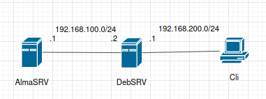

<h1 align="center">
<hr>
<a href="https://git.io/typing-svg"></a>
</h1>

## Debian-based 

### DHCP-сервер
1. Установить пакет isc-dhcp-server
```
apt install isc-dhcp-server
```
2. Указать сетевой интерфейс, с которого будет присылаться IP-адрес
```
/etc/default/isc-dhcp-server

INTERFACESv4="<interface-name>"
```
3. Выполнить настройку DHCP-сервера
```
/etc/dhcp/dhcpd.conf

authorative;

subnet 192.168.100.0 netmask 255.255.255.0 {
    range 192.168.100.5 192.168.100.254;
    option routers 192.168.100.1;
    option subnet-mask 255.255.255.0;
    option broadcast-address 192.168.100.255;
    default-lease-time 600;
    max-lease-time 7200;
    option domain-name "local";
    option domain-name-servers 1.1.1.1, 8.8.8.8;
}
```
4. Перезапустить DHCP-сервер
```
systemctl restart isc-dhcp-server
```
>Если возникла ошибка [Failed to start LSB: DHCP server](#), то:
1. Если dhcpd запущен, остановить его, убить процесс и удалить файл pid. Если не запущен, то просто удалить pid.
```
systemctl disable --now dhcpd
kill -15 $(ps ax | grep dhcp)
rm -f /var/run/dhcpd.pid
```
2. Рестартнуть isc-dhcp-server

### DHCP-клиент
#### Debian 
1. Настроить интерфейс
```
/etc/network/interfaces

auto <interface-name>
iface <interface-name> inet dhcp
```
2. Перезапустить менеджер сети
```
systemctl restart NetworkManager.service
или
systemctl restart networking
```
3. Запустить интерфейс вручную, если не запустился после перезапуска менеджера сети
```
ifup <interface-name>
```
4. Запуск вручную, если не прилетел адрес
```
dhclient -r <interface-name>
```
#### Ubuntu 
1. Отредактировать конфиг netplan
```
/etc/netplan/01-netcfg.yaml

network:
  version: 2
  renderer: NetworkManager  # по умолчанию networkd
  ethernets:
    <interface-name>:
      dhcp4: yes
      dhcp-identifier: mac  # если в качестве DHCP-сервера используется Windows Server
```
2. Сгенерировать конфигурационные файлы
```
netplan generate
```
3. Протестировать конфигурацию
```
netplan try
```
4. Применить конфигурацию
```
netplan apply
```

## RHEL-based 
### DHCP-сервер
1. Установить пакет dhcp-server
```
dnf install dhcp-server
```
2. Настроить DHCP-сервер
```
/etc/dhcp/dhcpd.conf

INTERFACESv4="<interface-name>"
authorative;

subnet 192.168.100.0 netmask 255.255.255.0 {
    range 192.168.100.5 192.168.100.254;
    option routers 192.168.100.1;
    option subnet-mask 255.255.255.0;
    option broadcast-address 192.168.100.255;
    default-lease-time 600;
    max-lease-time 7200;
    option domain-name "local";
    option domain-name-servers 1.1.1.1, 8.8.8.8;
}
```
3. Запустить службу DHCP
```
systemctl restart dhcpd
systemctl status dhcpd
systemctl enable dhcpd
```
4. Настроить файрвол
```
firewall-cmd --add-port=67/udp --permanent
firewall-cmd --reload
```

### DHCP-клиент
1. Установить DHCP-клиент
```
dnf install dhcp-client
```
2. Запустить DHCP-клиент
```
dhclient
```
>Или с помощью конфигурационного файла
1. Отредактировать конфигурационый файл
```
/etc/sysconfig/network-scripts/ifcfg-<interface-name>

DEVICE=<interface-name>
BOOTPROTO=dhcp
ONBOOT=yes
NM_CONTROLLED=yes  # управляется через NetworkManager
```
2. Перезапустить сервис
```
systemctl restart NetworkManager.service
или
systemctl restart network
```

### Настройка DHCP-Relay
<div align="center">

</div>

1. Настроить DHCP-сервер на AlmaSRV
```
/etc/dhcp/dhcpd.conf

DHCPDARGS="<interface-name>"
authorative;

shared-network Combined-pools {
  # клиентская сеть
  subnet 192.168.200.0 netmask 255.255.255.0 {
    range 192.168.200.10 192.168.200.254;
    option routers 192.168.200.1;
    option subnet-mask 255.255.255.0;
    option broadcast-address 192.168.200.255;
    default-lease-time 600;
    max-lease-time 7200;
    option domain-name-servers 192.168.200.1, 1.1.1.1;
  }

  subnet 192.168.100.0 netmask 255.255.255.0 {
  }
}
```
2. Установить DHCP-Relay на DebSRV
```
apt install isc-dhcp-relay
```
3. Настроить DHCP-Relay
```
/etc/default/isc-dhcp-relay

SERVERS="192.168.100.1"  # AlmaSRV
INTERFACES="<interface-name>" # интерфейс, смотрящий в клиентскую сеть
```
5. Перезапустить DHCP-Relay
```
systemctl restart isc-dhcp-relay
```